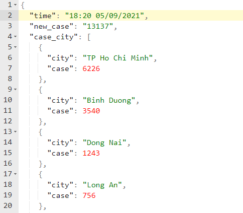

# Using Scrapy to crawl data from Covid 19 Website info in Vietnam

## Requirement

Crawl data from Vncovid19 Website

URL: <http://web.archive.org/web/20210907023426/https://ncov.moh.gov.vn/vi/web/guest/dong-thoi-gian>

Example for Cotent on Website


Extract and Transform data to Json format


## Run command

Project structure

```struct
[vncovid19]
|__ scrapy.cfg
|__ [scrapy_project]
   |__ __init__.py
   |__ items.py
   |__ middlewares.py
   |__ pipelines.py
   |__ settings.py
   |__ [spiders]
      |__ __init__.py
      |__ covid19_spider.py
```

```shell
cd scrapy-crawl-web\vncovid19\
scrapy crawl covid19_spider -o covid19.json
```

Check data crawl in `covid19.json` file

---
---

## Scrapy playground

### 1. Create scrapy project

```shell
mkdir projects
cd projects
scrapy startproject scrapy_project
```

Running the command above will create the folder structure as per below

```struct
[projects]
|__ scrapy.cfg
|__ [scrapy_project]
   |__ __init__.py
   |__ items.py
   |__ middlewares.py
   |__ pipelines.py
   |__ settings.py
   |__ [spiders]
      |__ __init__.py
```

### 2. Run command to create Scrapy spider

```shell
cd scrapy_project
scrapy genspider covid19_spider web.archive.org/web/20210907023426/https://ncov.moh.gov.vn/vi/web/guest/dong-thoi-gian
```

Running the command above will create `covid19_spider.py` file in `/projects/scrapy_project/spiders` folder structure as per below

```struct
[projects]
|__ scrapy.cfg
|__ [scrapy_project]
   |__ __init__.py
   |__ items.py
   |__ middlewares.py
   |__ pipelines.py
   |__ settings.py
   |__ [spiders]
      |__ __init__.py
      |__ covid19_spider.py
```

### 3. Using scrapy shell to crawl data from web

```shell
scrapy shell
fetch("https://web.archive.org/web/20210907023426/https://ncov.moh.gov.vn/vi/web/guest/dong-thoi-gian")
response.body
view(response)
exit
```
