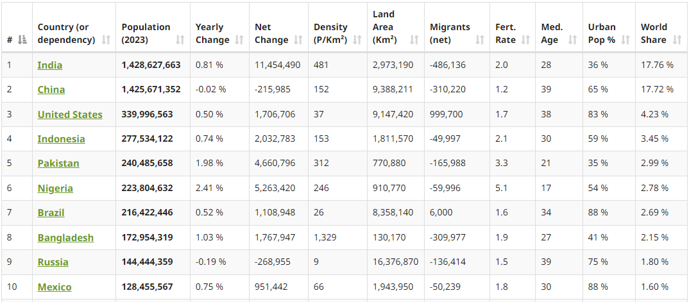
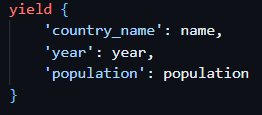
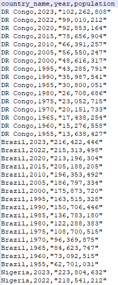

# Using Scrapy to crawl data from Countries in the world by population

## Requirement

Crawl data Countries in the world by population Website

URL: <https://www.worldometers.info/world-population/population-by-country/>

Example for Cotent on Website



Extract and Transform data to Json format



Output csv file result



## Run command

Project structure

```struct
[worldometers]
|__ scrapy.cfg
|__ [worldometers]
   |__ __init__.py
   |__ items.py
   |__ middlewares.py
   |__ pipelines.py
   |__ settings.py
   |__ [spiders]
      |__ __init__.py
      |__ countries.py
```

Run command below to get result

```shell
cd worldometers\worldometers\
scrapy crawl countries -o export.csv
```

Check data crawl in `export.csv` file

---
---

## Scrapy playground

### 1. Create scrapy project

```shell
mkdir projects
cd projects
scrapy startproject scrapy_project
```

Running the command above will create the folder structure as per below

```struct
[projects]
|__ scrapy.cfg
|__ [scrapy_project]
   |__ __init__.py
   |__ items.py
   |__ middlewares.py
   |__ pipelines.py
   |__ settings.py
   |__ [spiders]
      |__ __init__.py
```

### 2. Run command to create Scrapy spider

```shell
cd worldometers
scrapy genspider countries https://www.worldometers.info/world-population/population-by-country/
```

Running the command above will create `countries.py` file in `/worldometers/worldometers/spiders` folder structure as per below

```struct
[worldometers]
|__ scrapy.cfg
|__ [worldometers]
   |__ __init__.py
   |__ items.py
   |__ middlewares.py
   |__ pipelines.py
   |__ settings.py
   |__ [spiders]
      |__ __init__.py
      |__ countries.py
```

### 3. Using scrapy shell to crawl data from web

```shell
scrapy shell
fetch("https://www.worldometers.info/world-population/population-by-country/")
response.body
view(response)
exit
```
